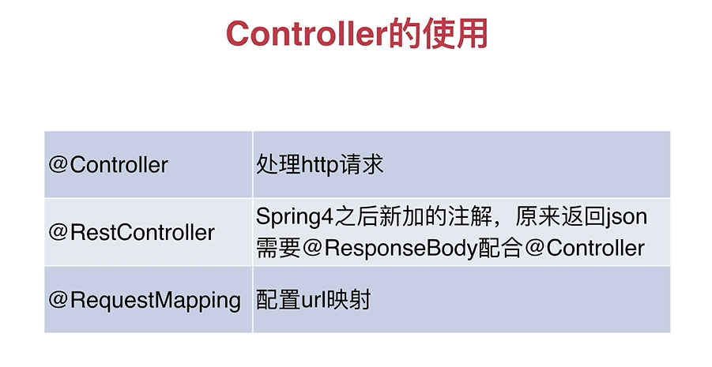
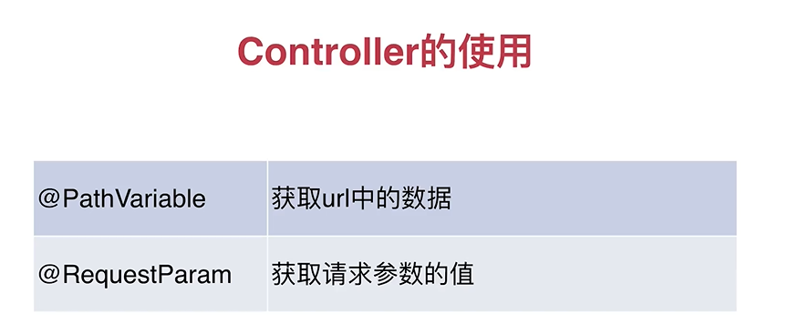
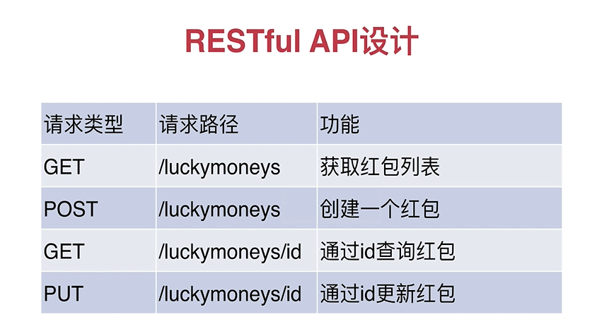

# SprignBoot 发红包后台服务

### Controller使用



### LuckymoneyController接口


### 服务打包启动
1, mvn打包
```
mvn clean package
```
2, 启动服务 
  1. 默认运行```java -jar target/luckymoney-0.0.1-SNAPSHOT.jar```
  2. 指定环境运行```java -jar -Dspring.profiles.active=prod target/luckymoney-0.0.1-SNAPSHOT.jar```
